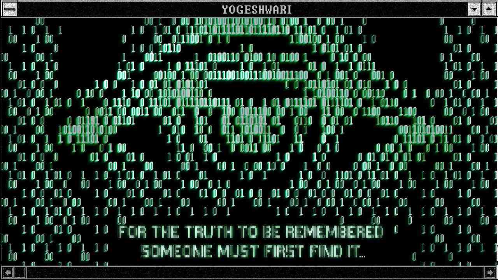

# yoKgUeWsEhNwIari Decoder & Encoder

A sleek, minimalistic web tool for encoding and decoding text using Morse code. Inspired by layered narratives and hidden messages in short films, this tool is perfect for solving interactive puzzles, analyzing ARG clue sequences, or exploring creative encryption.



## ✨ Features

- **🔐 Encode Text to Morse Code** - Convert any text into International Morse Code
- **🔓 Decode Morse Code to Text** - Translate Morse code back into readable text
- **🎨 Beautiful Glassmorphic UI** - Modern design with backdrop blur effects
- **📱 Fully Responsive** - Works seamlessly on desktop, tablet, and mobile devices
- **⚡ Real-time Conversion** - Instant encoding and decoding with a single click
- **🎯 Clean & Intuitive** - Minimalist interface for maximum usability

## 🚀 Live Demo

[View Live Demo](#) <!-- Add your GitHub Pages or deployment URL here -->

## 🛠️ Technologies Used

- **HTML5** - Semantic markup structure
- **CSS3** - Modern styling with CSS variables, glassmorphism, and animations
- **Vanilla JavaScript** - Pure JS with no dependencies
- **Morse Code Standard** - International Morse Code with support for:
  - Letters (A-Z)
  - Numbers (0-9)
  - Common punctuation marks (. , ? ' ! / ( ) & : ; = + - _ " $ @)

## 📦 Installation

1. **Clone the repository**
   ```bash
   git clone https://github.com/MrSamSeen/yoKgUeWsEhNwIari.git
   cd yoKgUeWsEhNwIari
   ```

2. **Open in browser**
   ```bash
   open index.html
   ```
   Or simply double-click `index.html` to open it in your default browser.

## 📁 Project Structure

```
yoKgUeWsEhNwIari/
├── index.html      # Main HTML structure
├── styles.css      # Styling and theme
├── script.js       # Morse code logic
├── img/
│   └── bg.jpg      # Background image
└── README.md       # Project documentation
```

## 🎯 Usage

### Encoding Text to Morse Code
1. Type or paste your text into the input field
2. Click the **Encode** button
3. The Morse code will appear in the output field
4. Spaces between words are represented by `/`

**Example:**
```
Input:  HELLO WORLD
Output: .... . .-.. .-.. --- / .-- --- .-. .-.. -..
```

### Decoding Morse Code to Text
1. Type or paste Morse code into the input field
2. Use spaces to separate letters
3. Use ` / ` (space-slash-space) to separate words
4. Click the **Decode** button
5. The decoded text will appear in the output field

**Example:**
```
Input:  .... . .-.. .-.. --- / .-- --- .-. .-.. -..
Output: HELLO WORLD
```

### Clear Fields
Click the **Clear** button to reset both input and output fields.

## 🎨 Customization

### Changing the Theme
Edit the CSS variables in `styles.css`:

```css
:root {
  --bg: #1a1a2e;                      /* Background color */
  --panel: rgba(255, 255, 255, 0.15); /* Panel background */
  --accent: #ff6b6b;                  /* Accent color (buttons) */
  --accent-hover: #ee5a52;            /* Button hover color */
  --text: #ffffff;                    /* Text color */
  --muted: rgba(255, 255, 255, 0.7);  /* Muted text */
  --radius: 12px;                     /* Border radius */
}
```

### Changing the Background Image
Replace `img/bg.jpg` with your own image, or update the path in `styles.css`:

```css
body::before {
  background-image: url(img/your-image.jpg);
}
```

## 🧩 Morse Code Reference

| Character | Morse Code | Character | Morse Code |
|-----------|------------|-----------|------------|
| A         | .-         | N         | -.         |
| B         | -...       | O         | ---        |
| C         | -.-.       | P         | .--.       |
| D         | -..        | Q         | --.-       |
| E         | .          | R         | .-.        |
| F         | ..-.       | S         | ...        |
| G         | --.        | T         | -          |
| H         | ....       | U         | ..-        |
| I         | ..         | V         | ...-       |
| J         | .---       | W         | .--        |
| K         | -.-        | X         | -..-       |
| L         | .-..       | Y         | -.--       |
| M         | --         | Z         | --..       |

| Number | Morse Code | Punctuation | Morse Code |
|--------|------------|-------------|------------|
| 0      | -----      | .           | .-.-.-     |
| 1      | .----      | ,           | --..--     |
| 2      | ..---      | ?           | ..--..     |
| 3      | ...--      | '           | .----.     |
| 4      | ....-      | !           | -.-.--     |
| 5      | .....      | /           | -..-.      |
| 6      | -....      | (           | -.--.      |
| 7      | --...      | )           | -.--.-     |
| 8      | ---..      | Space       | /          |
| 9      | ----.      |             |            |

## 🤝 Contributing

Contributions are welcome! Here's how you can help:

1. Fork the repository
2. Create a new branch (`git checkout -b feature/amazing-feature`)
3. Make your changes
4. Commit your changes (`git commit -m 'Add some amazing feature'`)
5. Push to the branch (`git push origin feature/amazing-feature`)
6. Open a Pull Request

## 📝 License

This project is open source and available under the [MIT License](LICENSE).

## 👨‍💻 Author

**SamSeen**
- YouTube: [@SamSeenVlogs](https://www.youtube.com/@SamSeenVlogs)

## 🙏 Acknowledgments

- Inspired by hidden messages and layered narratives in short films
- Built with minimalism and user experience in mind
- International Morse Code standard

---

Made with ❤️ by [SamSeen](https://www.youtube.com/@SamSeenVlogs)

